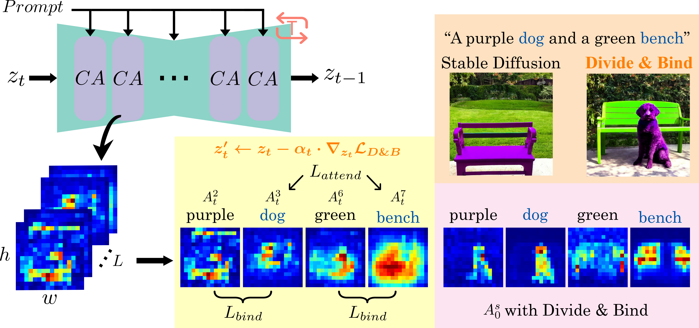
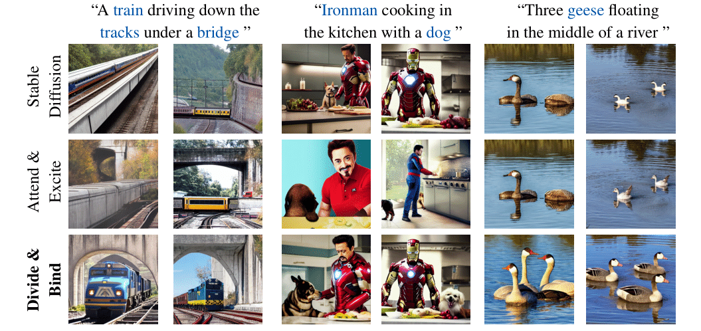

# Divide & Bind Your Attention for Improved Generative Semantic Nursing     

:fire:  Official PyTorch implementation for paper 'Divide & Bind Your Attention for Improved Generative Semantic Nursing' (BMVC 2023 **Oral**)


[](https://arxiv.org/pdf/2307.10864.pdf)    [](https://sites.google.com/view/divide-and-bind)

**:fire: Updates:** We update our [Divide & Bind pipeline](divide_and_bind/pipeline_divide_and_bind_latest.py), which is now compatible with [Diffusers](https://github.com/huggingface/diffusers) 0.21.4!

   
   


## Getting Started

Our environment is built on top of [Stable Diffusion](https://github.com/CompVis/stable-diffusion):
```
conda env create -f environment/environment.yaml  
conda activate ldm
```
Additional required packages are listed in [environment/requirement.txt](environment/requirement.txt).    

Stable Diffusion v1.5 model can be found [here](https://huggingface.co/runwayml/stable-diffusion-v1-5).

## Generation

 - [generate_images.ipynb](generate_images.ipynb) provides an example on how to generate images using Divide & Bind.
 -  [examples_generation.ipynb](examples_generation.ipynb) provides some prompts and seeds used in the paper. Example images are saved in [example_outputs](example_outputs).

## Citation
If you use this code please cite

```
@inproceedings{li2023divide,
  title={Divide \& bind your attention for improved generative semantic nursing},
  author={Li, Yumeng and Keuper, Margret and Zhang, Dan and Khoreva, Anna},
  booktitle={34th British Machine Vision Conference 2023, {BMVC} 2023},
  year={2023}
}
```


## License

This project is open-sourced under the AGPL-3.0 license. See the
[LICENSE](LICENSE) file for details.

For a list of other open source components included in this project, see the
file [3rd-party-licenses.txt](3rd-party-licenses.txt).


## Purpose of the project

This software is a research prototype, solely developed for and published as
part of the publication cited above. It will neither be
maintained nor monitored in any way.


## Contact
Please feel free to open an issue or contact personally if you have questions, need help, or need explanations. Don't hesitate to write an email to the following email address:
liyumeng07@outlook.com  
